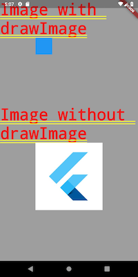

# Flutter canvas drawImage bug

A Flutter demo as an example to showcase that canvas.drawImage is not working.

In the upper part of the screenshot the picture is created with PictureRecorder and Canvas. On the canvas drawImage and drawRect is used.
The rectangle is shown whereas the image is not.

The lower part of screenshot shows that the image is correctly loaded and can be shown, if PictureRecorder and Canvas is not used.